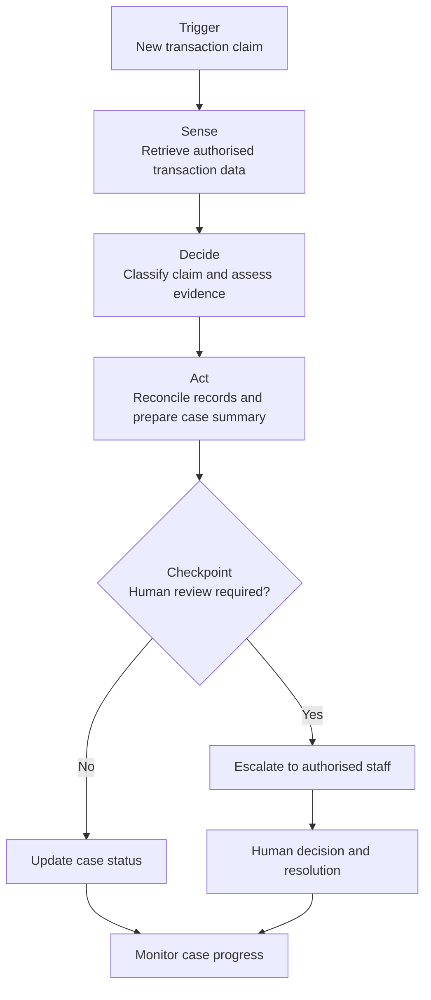

# MoMo Transaction Claims Resolution Agent

```mermaid
flowchart TD
    A["Trigger<br/>New transaction claim"] --> B["Sense<br/>Retrieve authorised transaction data"]
    B --> C["Decide<br/>Classify claim and assess evidence"]
    C --> D["Act<br/>Reconcile records and prepare case summary"]
    D --> E{"Checkpoint<br/>Human review required?"}
    E -->|Yes| F["Escalate to authorised staff"]
    E -->|No| G["Update case status"]
    F --> H["Human decision and resolution"]
    G --> I["Monitor case progress"]
    H --> I
```
